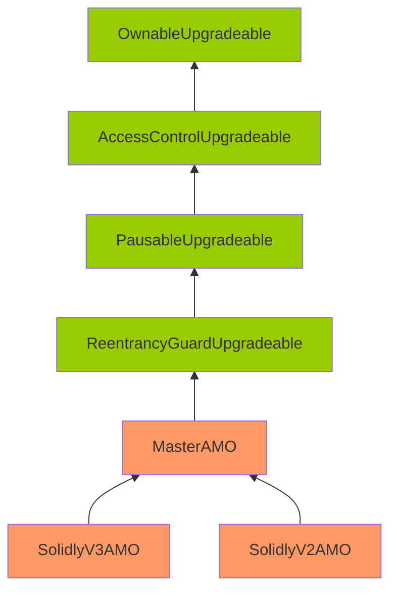

Wobbly Umber Haddock

Medium

# Corruptible upgradability pattern

### Summary

The storage of SolidlyV2AMO and SolidlyV3AMO contracts might be corrupted during an upgrade.

### Root Cause

Following is the inheritance structure of the [MasterAMO](https://github.com/sherlock-audit/2024-10-axion/blob/c65e662999d0c79439703fc6713814b4ad023e01/liquidity-amo/contracts/MasterAMO.sol), [SolidlyV2AMO](https://github.com/sherlock-audit/2024-10-axion/blob/c65e662999d0c79439703fc6713814b4ad023e01/liquidity-amo/contracts/SolidlyV2AMO.sol) and [SolidlyV3AMO](https://github.com/sherlock-audit/2024-10-axion/blob/c65e662999d0c79439703fc6713814b4ad023e01/liquidity-amo/contracts/SolidlyV3AMO.sol) contracts:

Note: The contracts highlighted in orange mean that there are no gap slots defined. The contracts highlighted in green mean that gap slots have been defined.

The gap storage has been implemented on the OpenZeppelin upgradeable contracts (OwnableUpgradeable, AccessControlUpgradeable, PausableUpgradeable, and ReentrancyGuardUpgradeable) inherited by MasterAMO.

However, no gap storage is implemented on the [MasterAMO](https://github.com/sherlock-audit/2024-10-axion/blob/c65e662999d0c79439703fc6713814b4ad023e01/liquidity-amo/contracts/MasterAMO.sol#L22-L28) contract itself, which is inherited by both SolidlyV2AMO and SolidlyV3AMO.

Thus, adding new storage variables to MasterAMO can potentially overwrite the beginning of the storage layout of the child contracts, causing critical misbehaviors in the system.

### Internal pre-conditions

- No storage gaps in MasterAMO.sol
- Devs add storage variables and upgrade the protocol

### External pre-conditions

_No response_

### Attack Path

_No response_

### Impact

Storage of SolidlyV2AMO and SolidlyV3AMO might be corrupted during upgrading, potentially causing the AMO contracts to be broken and assets to be stuck.

### PoC

_No response_

### Mitigation

_No response_