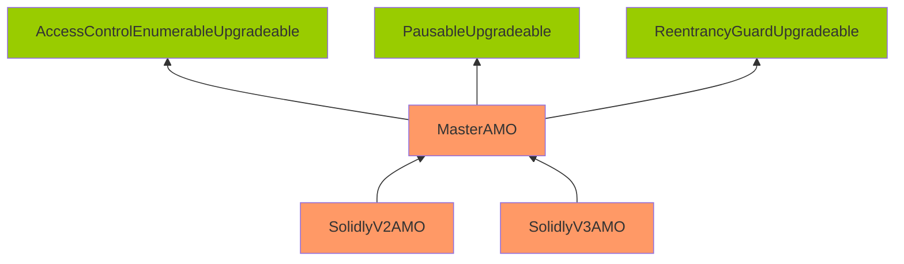
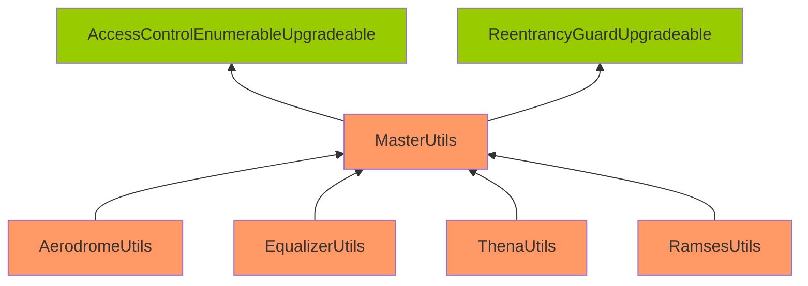

Rough Fossilized Crab

Medium

# Corruptible Upgradability Pattern

### Summary

The storage of Utils and AMO contracts may become corrupted during upgrades.

### Root Cause

Below is the inheritance diagram for the implementation of Utils and AMO contracts.

**Note:** Contracts highlighted in Orange indicate that no gap slots are defined. Contracts highlighted in Green indicate that gap slots have been defined.

[MasterAMO.sol](https://github.com/sherlock-audit/2024-10-axion/blob/3704f19ea52ebe255861ded3da0d3648c764fb69/liquidity-amo/contracts/MasterAMO.sol#L27-L27)

[MasterUtils.sol](https://github.com/sherlock-audit/2024-10-axion/blob/3704f19ea52ebe255861ded3da0d3648c764fb69/solidly-utils/contracts/MasterUtils.sol#L12-L12)

Both the Utils and AMO contracts are meant to be upgradeable, but they inherit from contracts that are not upgrade-safe.

The base contracts, `MasterUtils` and `MasterAMO`, contain many variables but do not include storage gap definitions (`__gaps`), unlike their base contracts from the OZ library.

Without gap slots, future integrations with new functionalities or integrated DEXs may face challenges, as adding contract variables at the base level and implementation level will not be possible without reserving space in storage.

Additionally, the protocol has explicitly stated that they aim for full compatibility with the upgradeable contract pattern.

### Internal pre-conditions

_No response_

### External pre-conditions

_No response_

### Attack Path

_No response_

### Impact

Storage of Utils and AMO contracts might be corrupted during upgrading.

### PoC

_No response_

### Mitigation

Gaps need to be added to at least the base contracts.