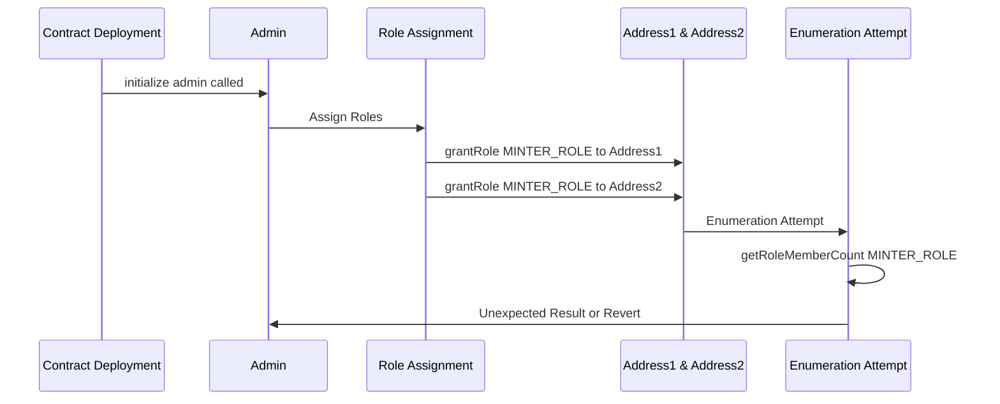

Massive Frost Yak

Medium

# Incorrect Initialization of AccessControlEnumerable in both BoostStablecoin and Minter Contract

### Summary

Incorrect initialization of `AccessControlEnumerable` will cause potential security vulnerabilities for the BoostStablecoin contract as it may lead to unexpected behavior in role management and enumeration.

### Root Cause

In [BoostStablecoin.sol:38](https://github.com/sherlock-audit/2024-10-axion/blob/c65e662999d0c79439703fc6713814b4ad023e01/liquidity-amo/contracts/BoostStablecoin.sol#L38) and [Minter.sol:42](https://github.com/sherlock-audit/2024-10-axion/blob/main/liquidity-amo/contracts/Minter.sol#L42), the contract incorrectly calls `__AccessControl_init()` instead of `__AccessControlEnumerable_init()`.

### Internal pre-conditions

1. The contract needs to be deployed and initialized.

### External pre-conditions

None

### Attack Path

1. The contract is deployed and initialized with the incorrect initialization function.
2. The contract fails to properly set up enumerable features for role management.
3. Attempts to use enumerable features (such as getRoleMember() or getRoleMemberCount()) may fail or return incorrect results.
4. This could lead to difficulties in managing roles, potentially allowing unauthorized access or preventing legitimate access to restricted functions.

Let's consider an example:



In this case, while roles are assigned, attempts to enumerate them may fail or produce incorrect results, leading to potential mismanagement of contract permissions.

### Impact

1. Enumerable features of `AccessControl` may not function as expected, leading to difficulties in role management.
2. Contract administrators may be unable to accurately track or verify role assignments.
3. This could indirectly lead to security vulnerabilities if role management becomes unreliable or opaque.

### Mitigation

Replace the incorrect initialization with the correct one:

BoostStableCoin.sol
```diff
function initialize(address admin) external initializer {
    __ERC20_init("Boost", "BOOST");
    __ERC20Burnable_init();
    __Pausable_init();
-   __AccessControl_init();
+   __AccessControlEnumerable_init();
    _grantRole(DEFAULT_ADMIN_ROLE, admin);
}
```


Minter.sol
```diff
function initialize(address boostAddress_, address collateralAddress_, address treasury_) external initializer {
-       __AccessControl_init();
+      __AccessControlEnumerable_init();
        __Pausable_init();
        _grantRole(DEFAULT_ADMIN_ROLE, msg.sender);
        if (boostAddress_ == address(0) || collateralAddress_ == address(0) || treasury_ == address(0))
            revert ZeroAddress();
        boostAddress = boostAddress_;
        collateralAddress = collateralAddress_;
        treasury = treasury_;
        boostDecimals = IERC20Metadata(boostAddress).decimals();
        collateralDecimals = IERC20Metadata(collateralAddress).decimals();
    }
```